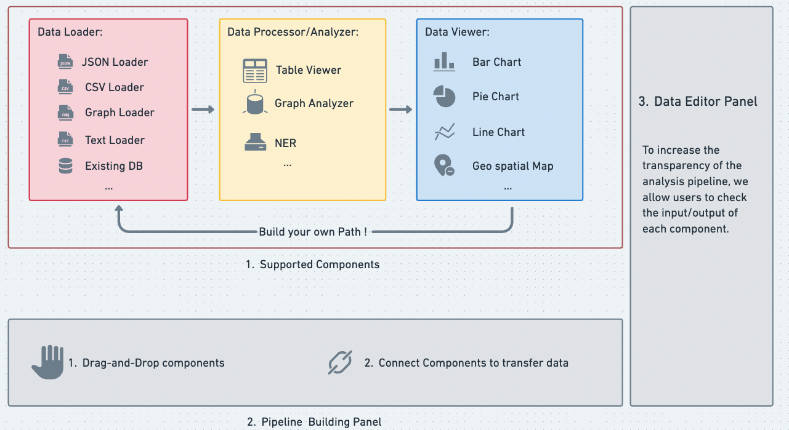

# Interactive Knowledge & Learning Environments (IKLEs)

## Overview
The framework consists of three major components:
* Components Panel: it provides three types of components for users to assist their analysis:
    * Data Loader:  Allowing users to upload their own data of various types, or link to existing databases in the ICICLE 
    * Data Processor/Analyzer: Assisting users in data processing or analyzing, such as:
        * filtering for tabular data, 
        * named entity recognition (NER) of textual data,
        * querying for graph data. 
    * Data Viewer: Visualizing data for users for insight discovery. We use the VegaLite to transform data into visualization. 
* Pipeline Building Panel: users can drag components to this panel to build their own analysis pipeline. 
* Data Editor Panel: it allows users to check/edit input and output of each component.
## Library 
We use Vue.js for front-end, Falsk for backend. Please check our git for more library we used in the project. 
Front-End           |  Back-End
:-------------------------:|:-------------------------:
  |  

<!-- ## Data Viewer
 -->

