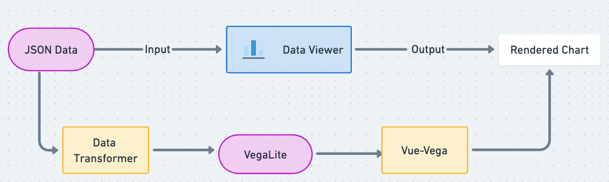
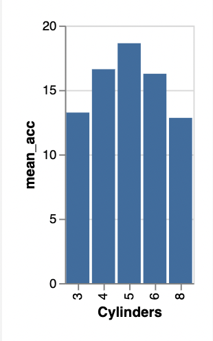

# [VegaLite: Connect data to visualization](https://vega.github.io/vega-lite/)
## Why we use VegaLite? 
* It is the most popular high-level grammar of graphics. 
* It works with a JSON syntax to build the visualization, which can be easily integrated into our component-based pipeline. 
* Users can fine-tune the visualization by editing the JSON syntax directly.
* Working seamlessly with Vue-Vega for chart rendering. 
## How we use VegaLite?

Once user drags one Data Viewer component and connects it to another component as input componnet. The input data goes through:
* Adding more attributes into the input JSON data, the attributes:
    * are added automatically based on the viewer type. 
    * are used for visualization and follows the VegaLite format. 
* The VegaLite scripts are rendered via Vue-Vega to generate the chart for users. 

## Something you need to know about VegaLite
 
### [Mark](https://vega.github.io/vega-lite/docs/mark.html) 
#### Definition
> Basic graphical elements in Vega-Lite are marks. Marks provide basic shapes whose properties (such as position, size, and color) can be used to visually encode data, either from a data field (or a variable), or a constant value.

### [Data Transformation](https://vega.github.io/vega-lite/docs/transform.html)

#### Definition
> Data transformations in Vega-Lite are described via either view-level transforms (the transform property) or field transforms inside encoding (bin, timeUnit, aggregate, sort, and stack).

### [Encoding](https://vega.github.io/vega-lite/docs/encoding.html)
#### Definition
> An integral part of the data visualization process is encoding data with visual properties of graphical marks. The encoding property of a single view specification represents the mapping between encoding channels (such as x, y, or color) and data fields, constant visual values, or constant data values (datum).

### Example 
* This example shows how the VegaLite specifies graphcis grammer, the selected chart may be not the best choice. 
* Input JSON data
```json
{
    "data": {
    "values": [
      {"a": "A", "b": 28}, {"a": "B", "b": 55}, {"a": "C", "b": 43},
      {"a": "D", "b": 91}, {"a": "E", "b": 81}, {"a": "F", "b": 53},
      {"a": "G", "b": 19}, {"a": "H", "b": 87}, {"a": "I", "b": 52}
    ]
  }
}
```


```json
{
  "$schema": "https://vega.github.io/schema/vega-lite/v5.json",
  "description": "Shows the relationship between horsepower and the numbver of cylinders using point marks with random offset (jittering).",
  "data": {"url": "data/cars.json"},
  "transform": [{"calculate": "random()", "as": "random"}],
  "height": {"step": 50},
  "mark": "point",
  "encoding": {
    "x": {"field": "Horsepower", "type": "quantitative"},
    "y": {"field": "Cylinders", "type": "ordinal"},
    "yOffset": {"field": "random", "type": "quantitative"}
  }
}
``` 



